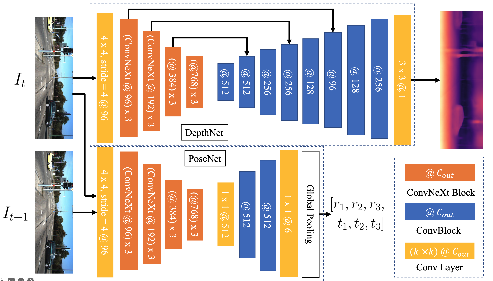
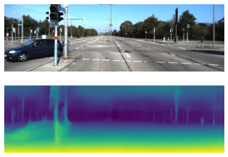
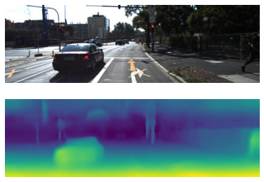

# Deep Unsupervised Networks for Visual Odometry

This is the project repo for ECE 285: Introduction to Visual Learning (Spring 2022).

Aiming at the problem of monocular camera motion estimation, we propose an end-to-end deep visual odometry (VO) model which can simultaneously complete camera motion tracking, depth estimation.

A short presentation of the project is available [here](https://drive.google.com/file/d/1_HjnsTkiieM_CchnDA69xKRCoQpmbKMM/view?usp=sharing).
A short video demonstrating the depth estimation is [here](https://drive.google.com/file/d/1qWXPks6gRD8AJ9U56oYTICheA6AbiLfj/view?usp=sharing).

## How to run the codes

First please install the requirements with:

```bash
pip install -r requirements.txt
```

The dataset is provided at here [kitti_256](https://1drv.ms/u/s!AiV6XqkxJHE2g1zyXt4mCKNbpdiw?e=ZJAhIlhttps://1drv.ms/u/s!AiV6XqkxJHE2g1zyXt4mCKNbpdiw?e=ZJAhIl).

Then please use `train.py` to train the models.

```bash
python train.py \
  --dataroot <DATASET_ROOT> \
  --batch_size 4
```

Some other parameters to be tuned is listed in the file.

## Architecture

The full network can be divided into two parts; depth, and pose networks. As proved, there is no transfer learning dependency between depth prediction and pose estimation. This leads to the separate design. Yet as in the model-based approaches, bundle adjustment (BA) is a crucial part. BA simultaneously optimizing the depth prediction and pose estimation, and improvement in performance has been observed. This leads us to connect the two separated model together in the loss function.



The top network, DepthNet, takes as input an image and returns a depth map; the bottom network, PoseNet, takes as input a pair of images and returns the relative camera pose change.

## Results

Here we demonstrate several results of the depth network.





However, the pose network failed to achieve a reasonably good result. This is because the training dataset does not include a sufficient variety of trajectories. This is what we would like to explore in the next step. Some possible directions are:

1. Concatenate depth map with the image to form a pseudo-RGBD input;

2. Use a recurrent neural network or attention layer to enforce a stronger joint optimization.